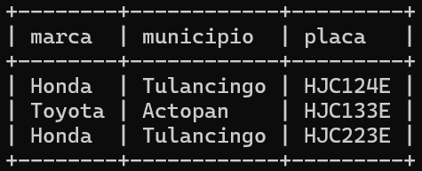
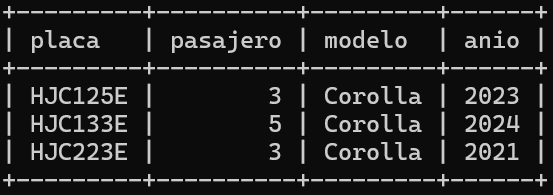
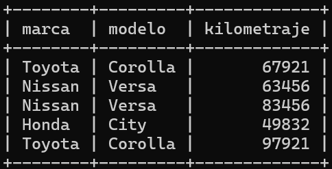
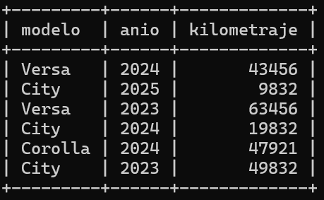
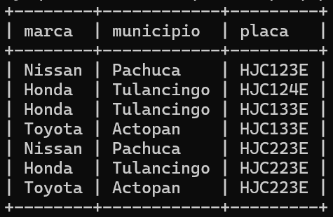

# Bloque 1. *Ejercicios de SQL*
_______________________________

Instrucciones. De acuerdo con la siguiente tabla, atributos y datos construye la sentencias SQL que resuelva la consulta y presenta el resultado.

Tabla *Automovil*.

| idAutomovil | marca | modelo | anio | kilometraje | municipio | pasajero | placa |
| --------- | --------- | --------- | --------- | --------- | --------- | --------- | --------- |
| 5671 | Nissan | Versa | 2024 | 43456 | Pachuca | 4 | HJC123E |
| 5672 | Honda| City | 2025 | 9832 | Tulancingo | 5 | HJC124E |
| 5673 | Toyota | Corolla | 2023 | 67921 | Actopan| 3 | HJC125E |
| 5674 | Nissan | Versa | 2023 | 63456 | Pachuca | 4 | HJC126E |
| 5675 | Honda| City | 2024 | 19832 | Tulancingo | 4 | HJC133E |
| 5676 | Toyota | Corolla | 2024 | 47921 | Actopan| 5 | HJC133E |
| 5677 | Nissan | Versa | 2022 | 83456 | Pachuca | 4 | HJC223E |
| 5678 | Honda| City | 2023 | 49832 | Tulancingo | 5 | HJC223E |
| 5679 | Toyota | Corolla | 2021 | 97921 | Actopan| 3 | HJC223E |

Consultas
---------------
1. Listado de todos los vehículos que tiene capacidad de trasladar a más de 4 pasajeros, incluye los datos de marca, municipio y placa.
   #### Solución
```sql
   SELECT marca, municipio, placa
   FROM automovil
   WHERE pasajero > 4;
```
   #### Salida
   
   
2. Listado de vehículos que trabajan en el Actopan, incluye los datos de placa, pasajero, modelo y anio.
   #### Solución
   ```sql
   SELECT placa, pasajero, modelo, anio
   FROM automovil
   WHERE municipio = 'Actopan';
   ```
   #### Salida
   
   
3. Listado de vehículos cuyo año de inicio de operación sea menor o igual a 2023, incluye los datos de marca, modelo y kilometraje.
   #### Solución
   ```sql
   SELECT marca, modelo, kilometraje
   FROM automovil
   WHERE anio <= 2023;
   ```
   #### Salida
   
   
4. Listado de vehículos que el kilometraje sea mayor a 5000 y menor a 65000, incluye los datos de modelo, anio y kilometraje.
   #### Solución
   ```sql
   SELECT modelo, anio, kilometraje
   FROM automovil
   WHERE kilometraje > 5000
   AND kilometraje < 65000;
   ```
   #### Salida
   

5. Listado de vehículos que corresponde verificación en septiembre-octubre, incluye los datos de marca, municipio y placa.
   #### Solución
   ```sql
   SELECT marca, municipio, placa
   FROM automovil
   WHERE SUBSTRING(placa, 6, 1) in ('1','2','3','4');
   ```
   #### Salida
   
